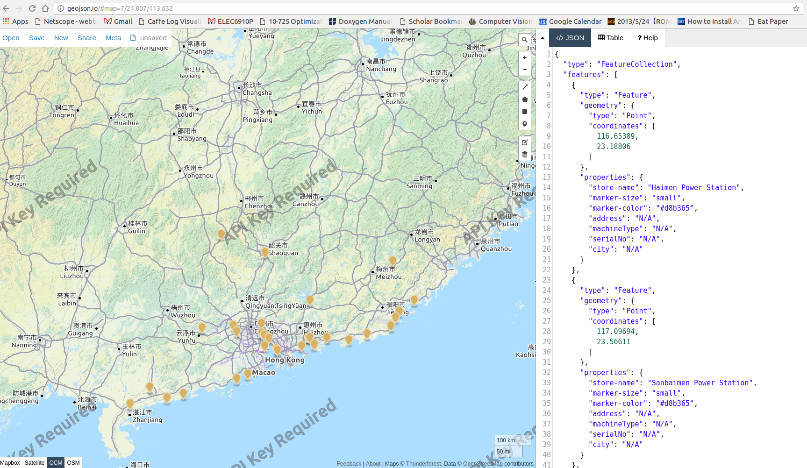

# Power Stations Mapping
Just a fun project to map power stations on the map. 

Basically, will retrive data from wikipedia: [https://en.wikipedia.org/wiki/List_of_major_power_stations_in_Guangdong](https://en.wikipedia.org/wiki/List_of_major_power_stations_in_Guangdong). 

With some manual intervention will convert each table to geojson. See GeoJSON [RFC](http://geojson.org/). Also see [sample geojson](https://github.com/johan/world.geo.json/blob/master/countries.geo.json). For examples, [also-see](http://geojson.io/). 

## Results
A preliminary map of Guangdong's coal plants looks like:

